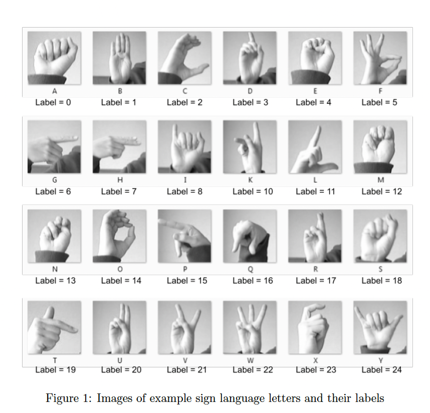
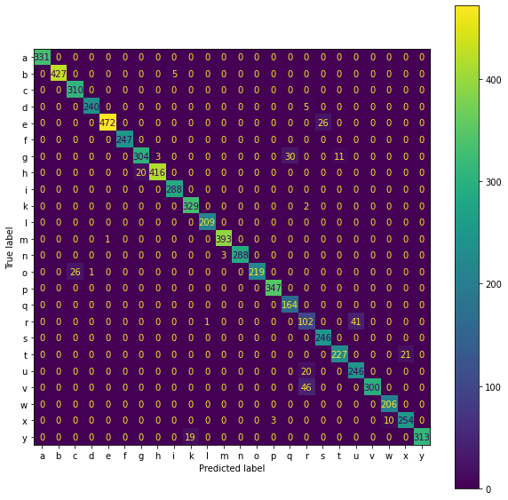
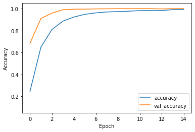

# HandsignClassifier
Sign Language Classifier Pipeline
===================
Classification task of the images of sign language letters, there are 3 docker containers responsible for recieving and posting rquests for creating, training, and evaluating CNN models.

Example set of Sign Language Images

Result & Progress
===================

Confusion Matrix of with given Test Data 

Training process of the CNN model

Model Creator Module
===================

Creates a CNN Model and saves it for further processes.

Sample POST Request for the service:

- **localhost:8010/cnncreator**

Input JSON:
- {}

Model Trainer Module
===================

Trains the given CNN Model and saves it for compile and train.

Sample POST Request for the service:

**localhost:8012/cnntrainer**

Input JSON: 
**{"action":"compile"}**
OR **{"action":"fit"}**
OR **{"action":"all"}**

Model Evaluator Module
===================

Evaluates and retrieves scores from the given CNN Model.
Sample POST Request for the service:

**localhost:8011/cnnevaluator**

Input JSON: 
**{"action":"eval"}**